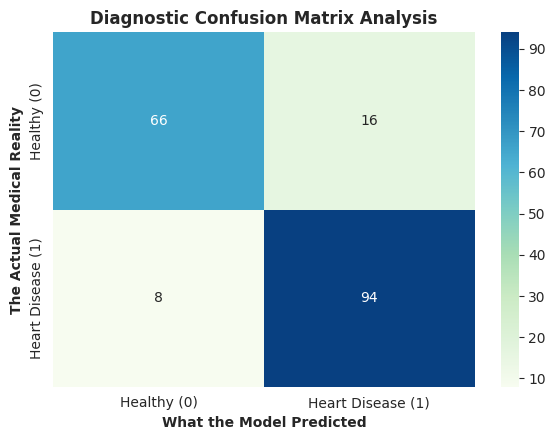
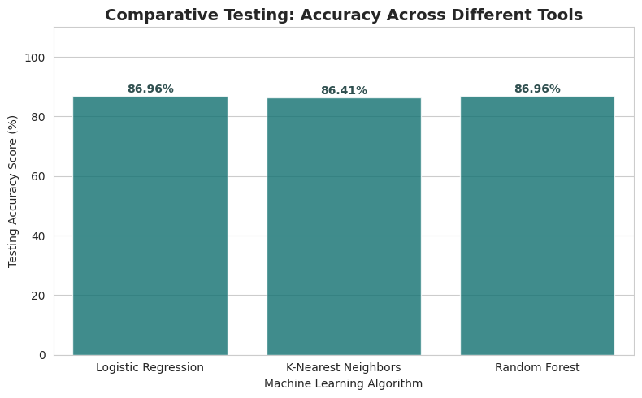

# 🫀 Heart Disease Diagnostic Pipeline & Automated Classifier

A structured, end-to-end data science pipeline built to clean medical data, explore clinical distributions dynamically, and evaluate multiple machine learning classifiers to predict heart disease risk accurately.

---

## 📊 Project Overview & Visual Insights

This project builds a clean, 15-cell diagnostic framework using the **UCI Heart Disease Dataset**. It features automated feature separation (categorical vs. continuous variables), overlapping data distribution matrices, and a side-by-side performance evaluation across different algorithmic baselines.

### 🧪 Visual Analysis Highlights
*   **Aesthetic Styling:** All visualizations use a high-contrast **Teal & Coral** color profile for clear data reading.
*   **Correlation Tracking:** Inter-variable mathematical patterns are isolated using an elegant, dense `mako` heat gradient profiles.

<!-- ADD YOUR VISUALIZATION GRID HERE -->
<p align="center">
  
</p>

---

## 🛠️ Data Pipeline Architecture

The interactive notebook runs through a structured 12-cell modular architecture:

1.  **Environment Setup & Global Styling:** Initializing global parameters and the custom color palette.
2.  **Imputation & Cleansing:** Handled missing records instantly using median replacements for numerical data and mode flags for objects to ensure complete grid processing.
3.  **Dynamic Filtering:** Automatically isolates features into separate arrays based on a strict unique-value threshold (<=10 unique entries classified as categorical).
4.  **Exploratory Analysis:** Dynamic multi-grid matrices tracking continuous metrics against categorical clinical variables.
5.  **Stratified Processing:** Features undergo dummy hot-encoding followed by an 80/20 stratified split to preserve true class distribution profiles.

---

## 🏆 Comparative Performance Scoreboard

We evaluated a combination of linear, distance-based, and tree-based ensemble models on the test split. 

### 📈 Model Evaluation Summary
| Machine Learning Tool | Hyperparameter State | Test Accuracy |
| :--- | :--- | :--- |
| **Logistic Regression** | Standard Scaled (Baseline Baseline) | `86.96%` |
| **Random Forest Classifier** | Baseline ($N=100$) | `86.96%` |
| **K-Nearest Neighbors (KNN)** | Standard Scaled ($K=5$) | `86.41%` |

<!-- ADD YOUR PERFORMANCE SCOREBOARD HERE -->
<p align="center">
  
</p>

> **Key Takeaway:** Interestingly, our baseline **Logistic Regression** and **Random Forest Classifier** achieved the exact same test accuracy score of **`86.96%`**, both outperforming the distance-based KNN approach.

---

## 🚀 How to Run the Project

### Prerequisites
Ensure you have the following Python libraries installed in your data science environment:
```bash
pip install pandas numpy matplotlib seaborn scikit-learn
